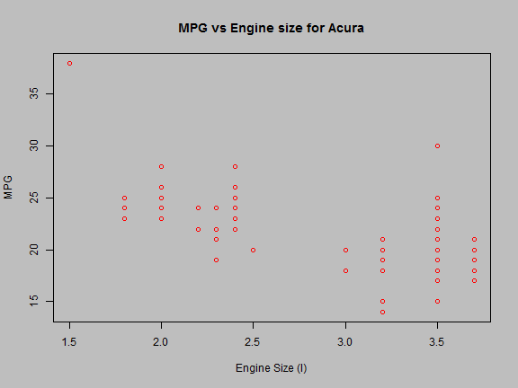
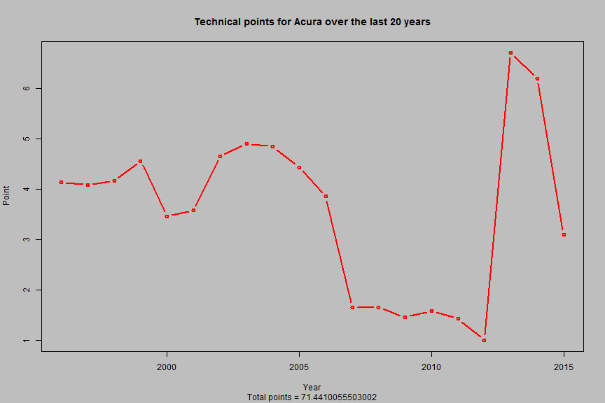

A look at cars MPG vs engine size
========================================================
author: Cuong Do
date: 22/2/2015

Motivation
========================================================

Cars' MPGs get better with smaller enginer size. 
But how much better?
* Depends on manufacturer
  + May be the Japanese makers are better in this respect
* Attemp to visualize this "technical ability"
  + fit a regression model to the MPG vs Engine size plot
- See how a manufacturer performs over the years

Example: Acura MPG vs Engine size
========================================================

 
*Source:
+http://www.fueleconomy.gov/feg/epadata/vehicles.csv.zip

How do we grade manufacturer?
========================================================
* Method: linear regression
  + fit a linear line and calculate the inverse of the slope

```r
fit <- lm( y~x) #linear regression model  
            meritPoint<- (-fit$coeff[2])
```
* Method: Quadratic Model
  + Fit a parabola and calculate the curvature of the fit

```r
fit2 <- lm( y~poly(x,2,raw=TRUE)) #quadratic regression model
meritPoint<- (fit2$coeff[3])
```

Visualize data over the year
========================================================

 
